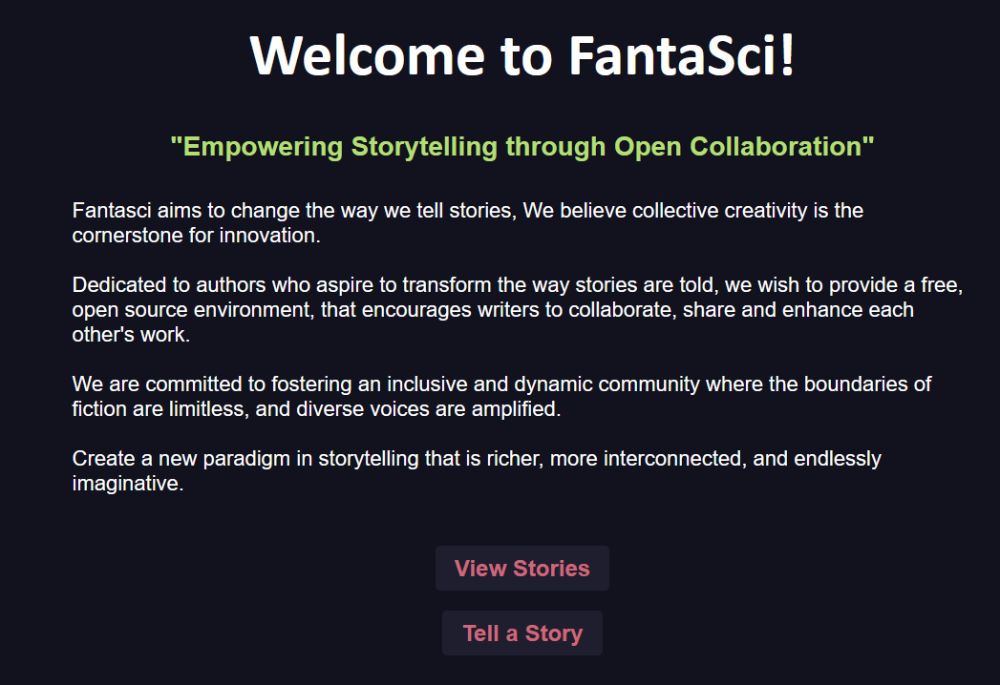
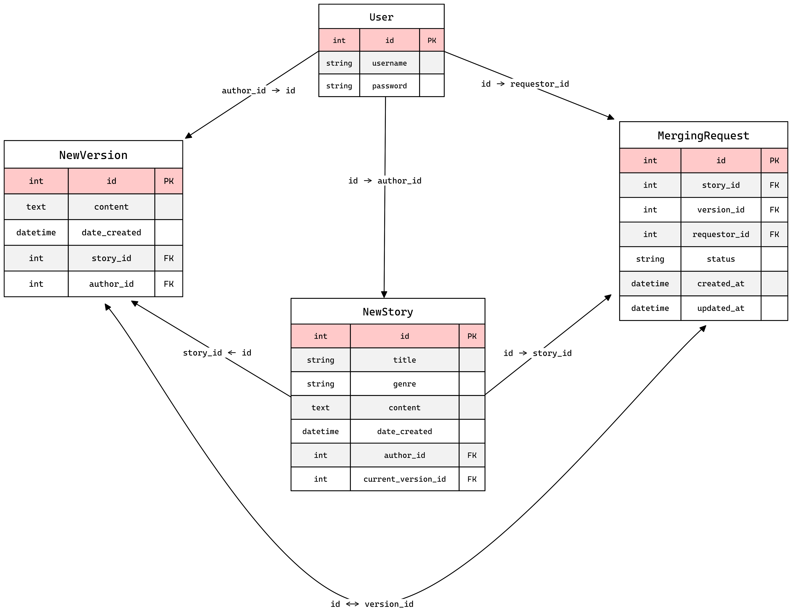

# BranchLibrary Project

*Ongoing project to create a site where users can collaborate with collective storytelling in an open source style of contribution.*

## Current Database Schema

## System for Collaboration
One of the main features I am attempting to implement is a version control system similar to how we might use something such as github
to collaborate on software projects. The idea being that a user can author a short story, and another user, or group of users can "fork"
that original content and add changes of their own. They then have the option to submit a request to the original owner of the content to 
"merge" these changes, similar to a PR in a git workflow. 

Currently this is a straight replace of the content if the merge is approved, I plan to implement a comparison functinoality that can allow
the original content's owner to easily see what has changed and make a more educated decision on wether to approve or deny a request. It is my 
hope that this system will be further built upon as I examine it's flaws in the future. This is the cornerstone of what this app is about.

## Backlog:
*Below are the backlog ToDo's for desired features.*

1) __Version Control System__
	- Fork Difference Comparison Summary.
	- ~~Pull Request system for content merges.~~
        - ~~PR GUI HTML & CSS Format~~
            - ~~Checkbox System~~
            - ~~Table List~~
            - ~~Theme Consistency~~
        - ~~Add PR Route to app file.~~
        - ~~added database schema for PR req.~~
        - ~~Altered "UPDATE" route in main.py to faciliate PR.~~
        - ~~Altered Update.html to show checkbox for PR.~~
    - ~~Schema for Forked Content.~~
	- ~~Content Version Directory.~~
    - ~~Make Delete action be exclusive to content owner.~~

2) __Community Features__
    - Create Account Deletion Functionality.
    - Active User Account directory[WIP].
        - Add Search Functionality
	    - ~~Added Directory of Users.~~
        - ~~Added list of Stories by user.~~
    - Integrated Instant Message system.
	- Contribution Point System.
    
3) __Text Editor UX__
	- ~~Font Selection for Editing.~~
	- ~~Style Customization.~~
	- User Themes.
	- Intellisense for text.

4) __General UX__
    - Improve routing when login, update or any other partial navigation occurs.
        - Currently users typically are routed back to index, instead route to last location prior to action.
    - When User creates new account, login new acct automatically, rather than require follow up login.

## Known Bugs:
1) ~~__Non Logged in Users can Attempt to edit a Story__~~
2) ~~Delete action in Story list does not work.~~
