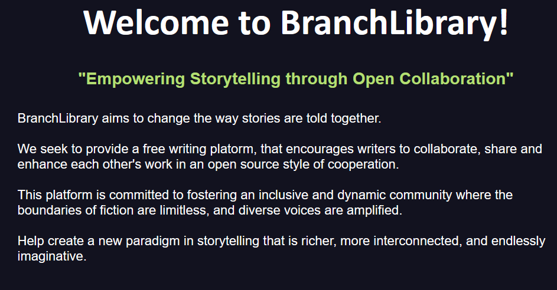

# BranchLibrary Project

*Ongoing project to create a site where users can collaborate with collective storytelling in an open source style of contribution.*

*Below are the backlog ToDo's for desired features.*

## Backlog:
1) __Version Control System__
    - Make Delete action be exclusive to content owner.
	- Fork Difference Comparison Summary.
	- Pull Request system for content merges[WIP].
        - PR GUI HTML & CSS Format
            - Checkbox System
            - Table List
            - Theme Consistency
        - ~~Add PR Route to app file.~~
        - ~~added database schema for PR req.~~
        - ~~Altered "UPDATE" route in main.py to faciliate PR.~~
        - ~~Altered Update.html to show checkbox for PR.~~
    - ~~Schema for Forked Content.~~
	- ~~Content Version Directory.~~

2) __Community Features__
	- Active User Account directory[WIP].
	    - ~~Added Directory of Users.~~
        - ~~Added list of Stories by user.~~
        - Add Search Functionality
    - Integrated Instant Message system.
	- Contribution Point System.
    
3) __Text Editor UX__
	- ~~Font Selection for Editing.~~
	- ~~Style Customization.~~
	- User Themes.
	- Intellisense for text.

4) __General UX__
    - Improve routing when login, update or any other partial navigation occurs.
        - Currently users typically are routed back to index, instead route to last location prior to action.

## Known Bugs:
1) ~~__Non Logged in Users can Attempt to edit a Story__~~

